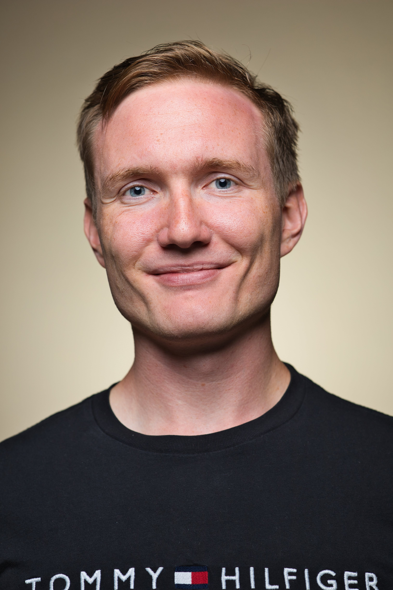

  

   
    
  juraj.bodik [at] unil.ch
  
  [Google scholar](https://scholar.google.com/citations?user=Ip7P8NIAAAAJ&hl=en)
  
  [Researchgate](https://www.researchgate.net/profile/Juraj-Bodik)

  

  

My nickname is Juro (pronounced like the money '€'), and I am a 4th year Ph.D. student under the supervision of [Prof. Valérie Chavez-Demoulin](https://wp.unil.ch/hecimpact/people/valerie-chavez-demoulin/) at the [University of Lausanne](https://www.unil.ch/hec/en/home.html), Switzerland. I have been fortunate to collaborate with researchers across several institutions, including [prof. Bin Yu](https://www.stat.berkeley.edu/~yugroup/index.html)
 at UC Berkeley where I spent half a year as a visiting researcher in 2024, colleagues at Stanford or collaborators at the University of Geneva.

My research is rooted in mathematical statistics, with a focus on [causal inference](https://thedecisionlab.com/reference-guide/statistics/casual-inference) and its connections to probability theory and machine learning. I study how to reason about quantities that cannot be directly observed—counterfactuals, extreme events, and the hidden mechanisms connecting them. My current work centers on the identifiability of causal relations from observational data and the development of methods for causal discovery, where the goal is to uncover the underlying causal structure directly from data. I also connect causal inference with topics such as [uncertainty quantification](https://en.wikipedia.org/wiki/Uncertainty_quantification), [extreme value theory](https://en.wikipedia.org/wiki/Extreme_value_theory), and [time series analysis](https://en.wikipedia.org/wiki/Granger_causality).

I was born in Slovakia and did my bachelor's and master's in pure mathematics at [Charles University](https://www.mff.cuni.cz/en) in Prague, Czech Republic. During this period, I competed and organized several international problem-solving [competitions](https://www.imc-math.org.uk/?year=2020&item=info) in mathematics. Back in Slovakia, I represented the [Slovak national team in the world championship in ultimate frisbee](https://wjuc2016.ultimatecentral.com/e/wfdf-2016-world-junior-ultimate-championships).

  

# Latest news
- Our paper was (conditinally) accepted in [Journal of Machine Learning Research](https://arxiv.org/abs/2303.15376), a leading journal in modern data science!
- Our paper was recently published in [Biometrika](https://academic.oup.com/biomet/advance-article/doi/10.1093/biomet/asaf042/8157876), the oldest  journal in statistics!
- In <del>August and September</del> December and January, I will be on a research visit at Osaka University in Japan, hosted by [Shohei Shimizu](https://www.shimizulab.org/lab). If you have recommendations for Japan or would like to meet up while I’m there, feel free to reach out!
- After returning from California, I injured my lower back playing ultimate frisbee and later had a bike accident (February 2025). I won’t be able to travel for up to a year but am very happy to collaborate remotely!

<small>Last page update: 27.10.2025.</small>

